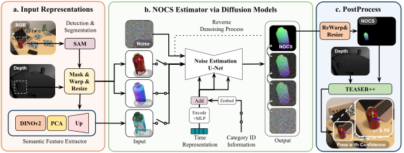

# DiffusionNOCS

## Overview



The repository contains the implementation of DiffusionNOCS inference.

The paper and github pages are available:
- **arXiv**: https://arxiv.org/abs/2402.12647
- **Github Pages**: https://woven-planet.github.io/DiffusionNOCS/

## Run on Google Colab
You can try the inference of DiffusionNOCS by clicking the link below and following instructions in the colab noteboook.

[](https://github.com/woven-planet/DiffusionNOCS/blob/main/notebooks/diffusion_nocs_for_colab.ipynb)<br>

## Run locally

### How to install

```bash
git clone https://github.com/woven-planet/DiffusionNOCS.git
cd DiffusionNOCS
./download.sh
python3 -m venv venv
source venv/bin/activate
pip install --upgrade pip
pip install -r requirements.txt
pip install -e .
ipython kernel install --user --name=venv
```

If you'd like to use your specific version, please modify `requirements.txt` based on your preference.

### Try inference on jupyter notebook
Run the following code:
```bash
jupyter notebook notebooks/diffusion_nocs.ipynb
```
Click `Kernel` tab, then change kernel to `venv`.

### Try inference from python file
Run the following code:
```bash
python3 scripts/inference.py  --category-name "bottle"
```

## About This Project and Us

This work has been done at Woven by Toyota, Inc, and Toyota Research Institute.

*Takuya Ikeda*, *Tianyi Ko*, *Robert Lee* and *Koichi Nishiwaki* are with the Woven by Toyota, Inc.

*Sergey Zakharov*, *Muhammad Zubair Irshad*, *Katherine Liu* and *Rares Ambrus* are with the Toyota Research Institute.

## Acknowledgement

The implementation was supported by *Yuki Igarashi* in Woven by Toyota, Inc. We'd like to express our deep gratitude to him.

## Reference

<pre>
@article{ikeda2024diffusionnocs,
  title={DiffusionNOCS: Managing Symmetry and Uncertainty in Sim2Real Multi-Modal Category-level Pose Estimation},
  author={Ikeda, Takuya and Zakharov, Sergey and Ko, Tianyi and Irshad, Muhammad Zubair and Lee, Robert and Liu, Katherine and Ambrus, Rares and Nishiwaki, Koichi},
  journal={arXiv preprint arXiv:2402.12647},
  year={2024}
}
</pre>

## License
[Apache License 2.0](LICENSE)