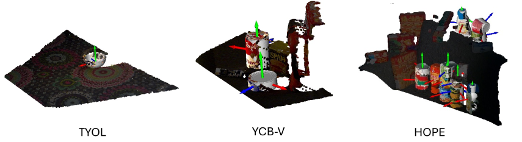

# Generalization Benchmark

Our introduced *Generalization Benchmark* consists of three datasets from the [BOP challenge](https://bop.felk.cvut.cz/home/) 
commonly used for instance-level pose estimation, 
[TYO-L](https://bop.felk.cvut.cz/datasets/#TYO-L), 
[YCB-V](https://bop.felk.cvut.cz/datasets/#YCB-V), and 
[HOPE](https://bop.felk.cvut.cz/datasets/#HOPE).

Each dataset poses different challenges to the baselines: 
TYO-L dataset features single-object scenes with five different lighting conditions and four different backgrounds; 
HOPE dataset contains highly occluded multi-object scenes with a very diverse pose distribution; 
YCB-V dataset contains multi-object scenes with light occlusions and is most similar to the NOCS dataset in terms of pose distribution.



## BOP to NOCS conversion script
Our script standardizes object poses to be consistently canonicalized 
with the [NOCS dataset](https://github.com/hughw19/NOCS_CVPR2019) and filters annotations to 
only contain the object categories present in NOCS, resulting in 4 categories for TYO-L and YCB-V (bottle, bowl, mug, can), 
and 2 categories for HOPE (bottle, can).

### How to process
1. Download TYO-L, YCB-V, and HOPE datasets from the [BOP website](https://bop.felk.cvut.cz/datasets/) using the `download_bop.sh` script:
    ```bash
    ./download_bop.sh
    ```
2. Run the `convert2nocs.sh` script to convert the downloaded datasets to the NOCS format as shown below. 
Converting 3D meshes requires installing [OpenCV](https://opencv.org/) and [Open3D](https://www.open3d.org/) before running the script. 
If you wish to avoid saving the 3D meshes, run `convert2nocs.sh` without any arguments.
    ```bash
    # Install OpenCV and Open3D
    pip install opencv-contrib-python==4.8.1.78        
    pip install open3d==0.18.0
    
    # Run conversion script
    ./convert2nocs.sh --save_models
    ``` 
    As a result, you should see `tyol_nocs`, `ycbv_nocs`, and `hope_nocs` folders under `datasets/`. 
    Feel free to remove the original `tyol`, `ycbv`, and `hope` folders if you don't need them anymore.


3. To visualize the converted datasets, use the `visualize.py` script pointing to the respective dataset. 
Open3D and converted mesh models are required.
    ```bash
    python3 scripts/visualize.py --data_dir datasets/hope_nocs
    ```

## References
```
Hodan, Michel et al.: BOP: Benchmark for 6D Object Pose Estimation, ECCV 2018
Xiang et al.: PoseCNN: A Convolutional Neural Network for 6D Object Pose Estimation in Cluttered Scenes, RSS 2018
Tyree et al.: 6-DoF Pose Estimation of Household Objects for Robotic Manipulation: An Accessible Dataset and Benchmark, IROS 2022